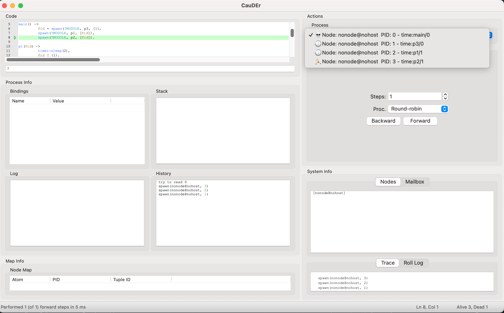

# Time extended CauDEr

CauDEr:A Causal-Consistent Reversible Debugger for Erlang.

In Time extended CauDEr, Erlang programs that include time transitions such as `timer:sleep(n)` can be executed.

## Running

### Using the Erlang shell

To start an Erlang shell with all the required dependencies, type:

    ./rebar3 shell

### Using the CauDEr

To start CauDEr application, type:

```
Eshell V16.0.2 (press Ctrl+G to abort, type help(). for help)
1> application:start(wx), application:start(cauder).
ok
```

ℹ️ To stop CauDEr you can use `application:stop(cauder)`, or simply close the
window.

ℹ️ If a process is in a sleeping state, a 🕔 icon is displayed.

